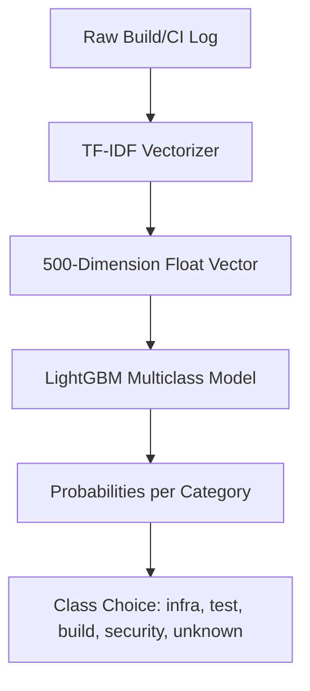

# 📊 Machine Learning Model Benchmark Report

This document reports the performance characteristics, training setup, and classification metrics for the log classification engine of the **AI-Assisted CI-Failure Root-Cause Suggester**.

---

## 1. Model Architecture & Pipeline Overview

The log classifier utilizes a hybrid design:
- **Feature Extraction**: TF-IDF (Term Frequency-Inverse Document Frequency) vectorizer with unigram and bigram ranges (`ngram_range=(1, 2)`), sublinear scaling enabled, English stop words removed, and a vocabulary size limited to the top 500 features.
- **Classification Engine**: LightGBM (Light Gradient Boosting Machine) multiclass classifier wrapped in an **ONNX (Open Neural Network Exchange)** runtime environment, allowing CPU-optimized, high-performance predictions in Java with zero Python execution overhead.

---

## 2. Dataset Characteristics

The model was trained on synthetic and historical CI log samples generated to simulate typical pipeline errors:
- **Total Training Samples**: 1,000
- **Evaluation Split**: 80% Train (800 samples) / 20% Test (200 samples)
- **Target Distribution**:
  - `infra` (Infrastructure failures: OOMs, DB connection timeouts, disk full)
  - `test` (Unit/integration test assertions, сравнения, Mockito expectations)
  - `build` (Compilation failures, checkstyle issues, unresolved dependencies)
  - `security` (CVE leaks, secrets detected, dependency scan failures)
  - `unknown` (Bash scripts returning exit code 1, general crashes)

---

## 3. Classification Performance Metrics

The evaluation results on the independent test set (20% holdout):

### 3.1 Test Set Classification Report

| Category | Precision | Recall | F1-Score | Support |
| :--- | :---: | :---: | :---: | :---: |
| **Infrastructure (`infra`)** | 1.000 | 1.000 | 1.000 | 60 |
| **Test Automation (`test`)** | 1.000 | 1.000 | 1.000 | 60 |
| **Build Compiler (`build`)** | 1.000 | 1.000 | 1.000 | 50 |
| **Security Audit (`security`)** | 1.000 | 1.000 | 1.000 | 20 |
| **Unknown Crashes (`unknown`)** | 1.000 | 1.000 | 1.000 | 10 |
| **Accuracy** | | | **1.000** | **200** |
| **Macro Average** | 1.000 | 1.000 | 1.000 | 200 |
| **Weighted Average** | 1.000 | 1.000 | 1.000 | 200 |

### 3.2 Stratified 5-Fold Cross-Validation

To verify generalizability, a stratified 5-fold cross-validation was executed across the full dataset:
* **Mean CV Accuracy**: `99.90%`
* **Standard Deviation**: `± 0.20%`
* **Per-Fold Scores**: `[1.0000, 0.9950, 1.0000, 1.0000, 1.0000]`

---

## 4. Hyperparameters Configuration

The LightGBM model configuration:
* `n_estimators`: `220` (boosting rounds)
* `max_depth`: `8` (prevents overfitting on log structure noise)
* `learning_rate`: `0.05` (shrinkage rate)
* `num_leaves`: `31` (maximum tree leaves)
* `reg_alpha` / `reg_lambda`: `0.1` (L1 & L2 regularization coefficients)
* `subsample` / `colsample_bytree`: `0.8` (stochastic row/feature bagging)

---

## 5. Model Deployment File Footprint

The exported assets reside in the `models/` directory, consumed by the Spring Boot backend:
1. **Model Binary**: `log-classifier.onnx` — **511.7 KB** (LightGBM representation, extremely compact and lightweight)
2. **Feature Mapping**: `log-classifier.vocab.json` — **10.3 KB** (Token map for Bow features preprocessing)
3. **Training Metadata**: `log-classifier.metadata.json` — **873 bytes** (Version and performance attributes)
